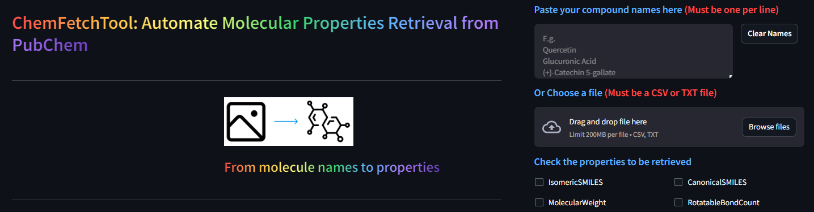

# [ChemFetchTool](https://chemfetchtool.streamlit.app/): Automate Molecular Properties Retrieval from PubChem

**[ChemFetchTool](https://chemfetchtool.streamlit.app/)** is a web-based user-friendly tool designed to streamline the process of retrieving SMILES notation (machine-readable representation) and other properties for chemical compounds directly from the PubChem database employing the PubChem PUG REST API endpoint for automated retrieval of molecular properties given only the compound name(s).

## Problem:
Researchers, particularly those in cheminformatics, often encounter scientific articles listing compounds with intriguing pharmacological effects, but solely by name. This necessitates manually searching PubChem for each compound's SMILES notation, a time-consuming and error-prone task, especially when dealing with thousands of entries.

## Solution:
ChemFetchTool eliminates this tedious process. By leveraging the freely available PubChem PUG REST API, it automates the retrieval of SMILES notation and additional properties, saving researchers valuable time and minimizing errors.

## Features:
- **Effortlessly retrieve Isomeric SMILES notation, crucial for preserving crucial stereo-chemical information.**
- **User-friendly interface designed for ease of use, eliminating the need for programming knowledge.**
- **Two convenient input methods:**
   - `Paste compound names directly into the dedicated section`.
   - `Upload a list of compounds in a CSV or TXT file`.
- **Select the specific properties you desire to retrieve, including SMILES notation and more.**

## How to Use:
1. **Visit ChemFetchTool ([https://chemfetchtool.streamlit.app/](https://chemfetchtool.streamlit.app/)).**
2. **Choose your input method:**
    - `Paste your compound names directly into the provided space`.
    - `Upload a file containing your list of compound names (CSV or TXT format)`.
3. **Select the desired properties you want to retrieve.**
4. **Click the "Submit Job" button to initiate the process.**

## Installation:
No installation is required.

## License: 
ChemFetchTool is freely available under the MIT License, enabling open access and unrestricted use. 

## Feedback and Contribution:
We welcome your feedback and suggestions for further enhancing ChemFetchTool. Feel free to reach out and share your thoughts. Additionally, if you're interested in contributing to the codebase, please don't hesitate to get in touch.

## Benefits:
ChemFetchTool empowers researchers with the following advantages:
- `Saves significant time compared to manual retrieval`.
- `Minimizes the risk of errors associated with manual data entry`.
- `Streamlines the workflow for cheminformatics tasks`.

## Citation: 
**If you make use of ChemFetchTool in your work, please cite it as follows:**

**●	Onah E. (2024). ChemFetchTool: Automate Molecular Properties Retrieval from PubChem (v1.1.0). Zenodo. https://doi.org/10.5281/zenodo.10850870.**